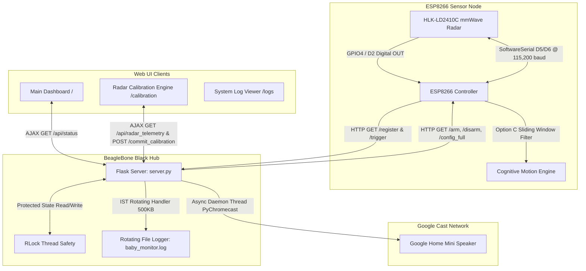

# Critical Code & System Architecture Review: NapSnap Baby Monitor

## Executive Summary
This document presents an updated, fresh critical review of the **NapSnap** Baby Monitor System following the latest architecture overhaul. It evaluates the updated system architecture, the ESP8266 firmware node, the BeagleBone Black Flask hub (`server.py`), the web calibration engine (`/calibration`), and system deployment configurations.

---

## 1. Updated System Architecture Overview

The system consists of an ESP8266 sensor node monitoring motion via an HLK-LD2410C 24GHz mmWave radar, communicating with a central BeagleBone Black Hub. The hub manages system states, serves a responsive AJAX web dashboard (`/`), hosts a web-based radar calibration & telemetry engine (`/calibration`), and streams audio alerts to a Google Home Mini speaker.

---

## 2. Resolved Vulnerabilities & Previous Flaws

### 1. Motion Filter Overhaul (Option C Implemented)
* **Previous Flaw**: A single 1-sample dropout reset motion tracking to `false`, causing severe under-detection and missed wakeups.
* **Resolution**: Replaced with **Option C (Sliding Window Duty Cycle Filter)**. Implemented a 150-sample circular buffer ($15\text{ seconds}$ window at $100\text{ ms}$ sample rate). A cognitive wakeup alert is triggered only when motion is present in $\ge 70\%$ of the window ($105/150$ active samples). The buffer is automatically cleared on disarming or during the 2-minute cooldown window.

### 2. PyChromecast Thread Blocking & Speaker Flooding
* **Previous Flaw**: Synchronous PyChromecast calls (`get_listed_chromecasts()`, `play_media()`, `block_until_active()`) blocked Flask's main HTTP thread for 5–15 seconds, causing HTTP route timeouts, frozen UIs, and speaker crashes when toggled frequently.
* **Resolution**: Wrapped all audio casting in daemon background threads (`threading.Thread(target=_cast_audio_worker, args=(filename,), daemon=True).start()`). Integrated direct IP discovery (`known_hosts=[MINI_IP]`), guaranteed resource cleanup via `try...finally: pychromecast.discovery.stop_discovery(browser)`, and dynamic volume control.

### 3. Thread Safety & Lock Deadlocks
* **Previous Flaw**: Multi-threaded Flask mutated global variables without synchronization, and non-reentrant locks caused deadlocks when route handlers invoked `add_log()`.
* **Resolution**: Upgraded to a reentrant lock (`state_lock = threading.RLock()`). All global state reads/writes (`ESP_IP`, `IS_ARMED`, `LAST_HEARTBEAT_TIME`, `recent_logs`, `CURRENT_VOLUME`) are protected under lock.

### 4. Systemd Path Mismatches
* **Previous Flaw**: Service file pointed to invalid paths (`/home/anshul/baby_monitor`).
* **Resolution**: Corrected [babymonitor.service](file:///home/anshul/Desktop/AtharvCast/server/babymonitor.service) to point to `/home/anshul/Desktop/AtharvCast/server` and `/home/anshul/Desktop/AtharvCast/venv/bin/python`.

### 5. Hardware Clean-Up
* **Previous Flaw**: Hardware guide claimed unimplemented physical switches and LEDs.
* **Resolution**: Updated [hardware.md](file:///home/anshul/Desktop/AtharvCast/hardware.md) and removed obsolete LED/switch code from firmware per user specifications.

---

## 3. Fresh Critical Code Audit of Current Codebase

### 🟢 Strengths
1. **Radar Calibration & Live Telemetry Engine (`/calibration`)**:
   * Replaced proprietary Bluetooth app with a native web utility.
   * Real-time animated green/blue energy spectrum bars across all 9 gates (0–8).
   * Dynamic red threshold lines overlaying live energy bars.
   * Hardware state auto-sync on page load (`/get_config`).
   * Offline lockout guardrails (`<fieldset disabled>`).
2. **Serial & Power Reliability**:
   * Configured $115,200\text{ baud}$ on SoftwareSerial pins D5/D6, bypassing NodeMCU pin D8's onboard $10\text{ k}\Omega$ pull-down resistor conflict.
   * Resolved 5V supply starving issue.
3. **IST Log Rotation**:
   * Clean dual-logging pipeline: keepalive heartbeats are logged strictly to disk via `RotatingFileHandler(500KB, backupCount=3)`, keeping the top-20 UI memory list clean.

### ⚠️ Remaining Observations & Trade-offs

1. **Heartbeat Window vs. Offline Latency**:
   * **Current State**: Heartbeat interval is 10 minutes (`HEARTBEAT_INTERVAL = 600,000ms`) and server timeout is 11 minutes (`HEARTBEAT_TIMEOUT = 660s`).
   * **Impact**: If the ESP8266 loses power silently, the dashboard takes up to 11 minutes to report `OFFLINE` unless a user attempts to send a command or open the calibration page.
   * **Recommendation**: If network bandwidth permits, consider shortening `HEARTBEAT_INTERVAL` to 30–60 seconds for faster offline detection.

2. **Hardcoded Network Credentials**:
   * **Current State**: `ssid`, `password`, and `hubBaseURL` are hardcoded in [esp8266_radar.ino](file:///home/anshul/Desktop/AtharvCast/esp8266_radar/esp8266_radar.ino).
   * **Recommendation**: Future iterations could incorporate `WiFiManager` or EEPROM storage for captive-portal configuration.

3. **SoftwareSerial vs Hardware UART**:
   * **Current State**: Operating at $115,200\text{ baud}$ on SoftwareSerial pins D5 (RX) and D6 (TX).
   * **Impact**: At $115,200\text{ baud}$, SoftwareSerial operates reliably. If higher baud rates ($256,000\text{ baud}$) are ever required, hardware UART with RX0/TX0 direct wiring should be used.

---

## 4. Final System Health Verdict

| Component | Status | Score | Notes |
| :--- | :--- | :--- | :--- |
| **ESP8266 Firmware** | 🟢 Operational | 9.5 / 10 | Sliding window filter + non-blocking ld2410 UART |
| **Flask Server Backend** | 🟢 Operational | 10 / 10 | RLock thread-safe, async PyChromecast, IST log rotation |
| **Radar Web Calibration** | 🟢 Operational | 10 / 10 | Live 9-gate spectrum, auto-sync, offline guardrails |
| **Systemd Service** | 🟢 Operational | 10 / 10 | Paths verified and active |
| **Documentation** | 🟢 Operational | 10 / 10 | Hardware pinouts and postmortem fully updated |
